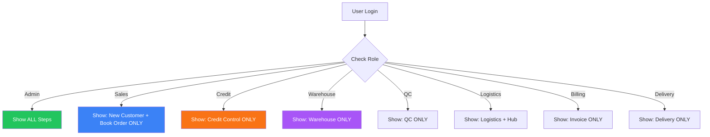
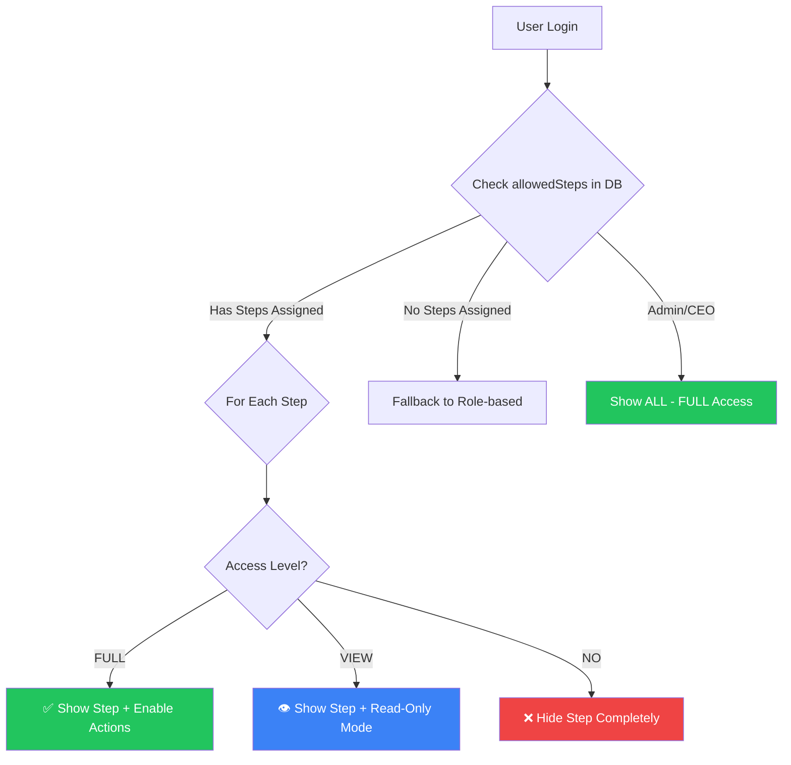

# 🔄 Access Control System — Current vs Proposed

---

## 📊 CURRENT SYSTEM (Jo abhi implemented hai)

### How It Works:
```
User logs in → Dashboard checks role/email → Show or Hide steps
Only 2 levels: ✅ SHOW  |  ❌ HIDE
```

### Current Access Table:

| User | Role | New Customer | Book Order | Credit Control | Warehouse | QC | Logistics | Invoice | Fleet Hub | Delivery |
|:-----|:-----|:---:|:---:|:---:|:---:|:---:|:---:|:---:|:---:|:---:|
| **Animesh** | Admin | ✅ | ✅ | ✅ | ✅ | ✅ | ✅ | ✅ | ✅ | ✅ |
| **Lavin** | CEO | ❌ | ❌ | ❌ | ❌ | ❌ | ✅* | ❌ | ❌ | ❌ |
| **Any Sales** | Sales | ✅ | ✅ | ❌ | ❌ | ❌ | ❌ | ❌ | ❌ | ❌ |
| **Credit Team** | Credit | ❌ | ❌ | ✅ | ❌ | ❌ | ❌ | ❌ | ❌ | ❌ |
| **Pranav** | WH | ❌ | ❌ | ❌ | ✅ | ❌ | ❌ | ❌ | ❌ | ❌ |
| **Dheeraj** | QC | ❌ | ❌ | ❌ | ❌ | ✅ | ❌ | ❌ | ❌ | ❌ |
| **Pratish** | Logistics | ❌ | ❌ | ❌ | ❌ | ❌ | ✅ | ❌ | ✅ | ❌ |
| **ATL Execs** | Billing | ❌ | ❌ | ❌ | ❌ | ❌ | ❌ | ✅ | ❌ | ❌ |
| **Sagar** | Hub | ❌ | ❌ | ❌ | ❌ | ❌ | ❌ | ❌ | ✅ | ❌ |
| **Delivery** | Delivery | ❌ | ❌ | ❌ | ❌ | ❌ | ❌ | ❌ | ❌ | ✅ |

### Current Flow Diagram:


### ❌ Problems with Current System:
- **ON/OFF only** — Either full access or nothing
- **Hardcoded per email** — Code changes needed for each user
- **No View mode** — User can't see other steps' data
- **No Admin control** — Can't change from app, need code change
- **Single step per person** — Sudip can't do Credit + Warehouse

---

## 🚀 PROPOSED SYSTEM (Jo implement karunga)

### How It Will Work:
```
User logs in → Dashboard checks allowedSteps from DB → 3 Access Levels
3 levels: ✅ FULL ACCESS  |  👁️ VIEW ONLY  |  ❌ NO ACCESS
Admin assigns from app — no code change needed!
```

### Proposed Access Table (Based on Your Spreadsheet):

| User | Dept | Master | Order | Credit | Warehouse | Packing | QC | Logistics | Invoice | DA Assign | Loading | Delivery |
|:-----|:-----|:---:|:---:|:---:|:---:|:---:|:---:|:---:|:---:|:---:|:---:|:---:|
| **Animesh** | Admin | ✅ | ✅ | ✅ | ✅ | ✅ | ✅ | ✅ | ✅ | ✅ | ✅ | ✅ |
| **Lavin** | CEO | ✅ | ✅ | ✅ | ✅ | ✅ | ✅ | ✅ | ✅ | ✅ | ✅ | ✅ |
| **Kunal** | Accounts | ✅ | ✅ | ✅ | ✅ | ✅ | ✅ | ✅ | ✅ | ✅ | ✅ | ✅ |
| **Sales MIS** | MIS | ✅ | ✅ | ❌ | ❌ | ❌ | ❌ | ❌ | ❌ | ❌ | ❌ | ❌ |
| **Sales Users** | Sales | ✅ | ✅ | 👁️ | 👁️ | 👁️ | 👁️ | 👁️ | 👁️ | 👁️ | 👁️ | 👁️ |
| **Credit Control** | Credit | 👁️ | 👁️ | ✅ | ❌ | ❌ | ❌ | ❌ | ❌ | ❌ | ❌ | ❌ |
| **Operations** | Ops | 👁️ | 👁️ | 👁️ | ✅ | ✅ | ❌ | ❌ | ❌ | ❌ | ❌ | ❌ |
| **Roshan (WH)** | WH | 👁️ | 👁️ | 👁️ | ✅ | ✅ | ✅ | 👁️ | 👁️ | ✅ | ✅ | ✅ |
| **Mumbai Store** | WH | 👁️ | 👁️ | 👁️ | ✅ | ✅ | ✅ | 👁️ | 👁️ | ✅ | ✅ | ✅ |
| **Dheeraj (QC)** | QC | 👁️ | 👁️ | 👁️ | 👁️ | 👁️ | ✅ | 👁️ | 👁️ | ❌ | ❌ | ❌ |
| **Quality** | QC | 👁️ | 👁️ | 👁️ | 👁️ | 👁️ | ✅ | 👁️ | 👁️ | ❌ | ❌ | ❌ |
| **Arun (Store)** | WH | 👁️ | 👁️ | 👁️ | ✅ | ✅ | 👁️ | ❌ | ❌ | ❌ | ❌ | ❌ |
| **Pratish** | Logistics | 👁️ | 👁️ | 👁️ | 👁️ | 👁️ | 👁️ | ✅ | ❌ | ❌ | ❌ | ❌ |
| **ATL Execs** | ATL | 👁️ | 👁️ | 👁️ | 👁️ | 👁️ | 👁️ | 👁️ | ✅ | ❌ | ❌ | ❌ |
| **Sandesh** | ATL | 👁️ | 👁️ | 👁️ | 👁️ | 👁️ | 👁️ | 👁️ | ✅ | 👁️ | ✅ | ✅ |
| **Delivery 1** | Delivery | 👁️ | ❌ | ❌ | ❌ | ❌ | ❌ | ❌ | ❌ | 👁️ | ✅ | ✅ |
| **Delivery 2** | Delivery | 👁️ | ❌ | ❌ | ❌ | ❌ | ❌ | ❌ | ❌ | ❌ | ❌ | ✅ |

> **Legend:** ✅ = FULL Access (can perform actions) | 👁️ = View Only (can see data) | ❌ = No Access (hidden)

### Proposed Flow Diagram:


---

## 🆚 Side-by-Side Comparison

| Feature | ❌ Current System | ✅ Proposed System |
|:--------|:-----------------|:-------------------|
| **Access Levels** | 2 (Show/Hide) | 3 (Full/View/No) |
| **Control From** | Hardcoded in code | Admin app (live) |
| **Can View Others' Steps?** | No | Yes (View mode) |
| **Multi-Step Per User?** | No (1 role = 1 step) | Yes (any combination) |
| **Solo Operation?** | No (dependent) | Yes (if assigned) |
| **Change Requires?** | Code change + push | Admin clicks in app |
| **Flexibility** | ⭐ Low | ⭐⭐⭐⭐⭐ High |

---

## 🛠️ Admin Screen - Step Assignment Control

### What Admin Sees:
```
╔═══════════════════════════════════════════════════════════════╗
║  📋 STEP ASSIGNMENT CONTROL                                  ║
╠═══════════════════════════════════════════════════════════════╣
║                                                               ║
║  STAGE 1 — BOOK ORDER                                        ║
║  ┌─────────────────────────────────────────────────────┐     ║
║  │ ✅ Animesh (FULL)  ✅ Sudip (FULL)  👁️ Credit (VIEW)│     ║
║  └─────────────────────────────────────────────────────┘     ║
║                                                               ║
║  STAGE 2 — CREDIT CONTROL                                    ║
║  ┌─────────────────────────────────────────────────────┐     ║
║  │ ✅ Pawan (FULL)  ✅ Kshama (FULL)  👁️ Sudip (VIEW) │     ║
║  └─────────────────────────────────────────────────────┘     ║
║                                                               ║
║  STAGE 3 — WAREHOUSE OPERATIONS                              ║
║  ┌─────────────────────────────────────────────────────┐     ║
║  │ ✅ Roshan (FULL)  ✅ Mumbai (FULL)  👁️ QC (VIEW)   │     ║
║  └─────────────────────────────────────────────────────┘     ║
║                                                               ║
║  STAGE 4 — QUALITY CONTROL                                    ║
║  ┌─────────────────────────────────────────────────────┐     ║
║  │ ✅ Dheeraj (FULL)  👁️ Roshan (VIEW)                │     ║
║  └─────────────────────────────────────────────────────┘     ║
║                                                               ║
║  ... (more stages)                                            ║
╚═══════════════════════════════════════════════════════════════╝
```

### Admin Clicks Step → Popup:
```
╔═══════════════════════════════════════╗
║     📦 WAREHOUSE OPERATIONS           ║
║     Select users & access level       ║
╟───────────────────────────────────────╢
║                                       ║
║  Sudip          [FULL ▼]              ║
║  Roshan         [FULL ▼]              ║
║  Mumbai Store   [FULL ▼]              ║
║  Credit Team    [VIEW ▼]              ║
║  Quality Team   [VIEW ▼]              ║
║  Pratish        [  NO ▼]              ║
║  Delivery       [  NO ▼]              ║
║                                       ║
║    [CANCEL]      [SAVE CHANGES]       ║
╚═══════════════════════════════════════╝
```

### Dropdown Options Per User:
```
┌──────────────┐
│ ✅ FULL Access│  ← Can perform actions
│ 👁️ View Only │  ← Can see data, read-only
│ ❌ No Access  │  ← Step hidden completely
└──────────────┘
```

---

## 📱 User Experience

### Sales User (Sudip) — WITH View Access:
```
Dashboard shows:
┌──────────────────────────────────────┐
│ ✅ STAGE 1 — BOOK ORDER      [ACTIVE]│  ← Can create orders
├──────────────────────────────────────┤
│ 👁️ STAGE 2 — CREDIT CONTROL  [VIEW] │  ← Can see status, can't approve
├──────────────────────────────────────┤
│ 👁️ STAGE 3 — WAREHOUSE       [VIEW] │  ← Can track packing, can't edit
├──────────────────────────────────────┤
│ 👁️ STAGE 5 — INVOICING       [VIEW] │  ← Can see invoice status
└──────────────────────────────────────┘
(Credit Alerts, QC, Fleet, Delivery = Hidden)
```

### Warehouse User (Roshan) — WITH Full + View:
```
Dashboard shows:
┌──────────────────────────────────────┐
│ 👁️ STAGE 1 — BOOK ORDER      [VIEW] │  ← Can see orders coming
├──────────────────────────────────────┤
│ ✅ STAGE 3 — WAREHOUSE       [FULL] │  ← Can pack, assign, manage
├──────────────────────────────────────┤
│ ✅ STAGE 4 — QC              [FULL] │  ← Can do quality checks
├──────────────────────────────────────┤
│ 👁️ STAGE 5 — LOGISTICS       [VIEW] │  ← Can see logistics status
├──────────────────────────────────────┤
│ ✅ STAGE 6 — FLEET LOADING   [FULL] │  ← Can load trucks
├──────────────────────────────────────┤
│ ✅ STAGE 7 — DELIVERY        [FULL] │  ← Can mark delivered
└──────────────────────────────────────┘
```

---

## 🗄️ Database Structure

### Current (Simple):
```json
{
  "allowedSteps": ["Book Order", "Credit Control"]
}
```

### Proposed (3-Level):
```json
{
  "stepAccess": {
    "Master Creation": "full",
    "Placed Order": "full",
    "Credit Approval": "view",
    "Warehouse": "view",
    "Packing": "view",
    "QC": "view",
    "Logistic Cost": "view",
    "Invoice": "view",
    "DA Assignment": "no",
    "Loading": "no",
    "Delivery Ack": "no"
  }
}
```

---

**Yeh hai full picture — Current vs Proposed! Approve karo toh 3-level system implement kar dun!** 🚀
