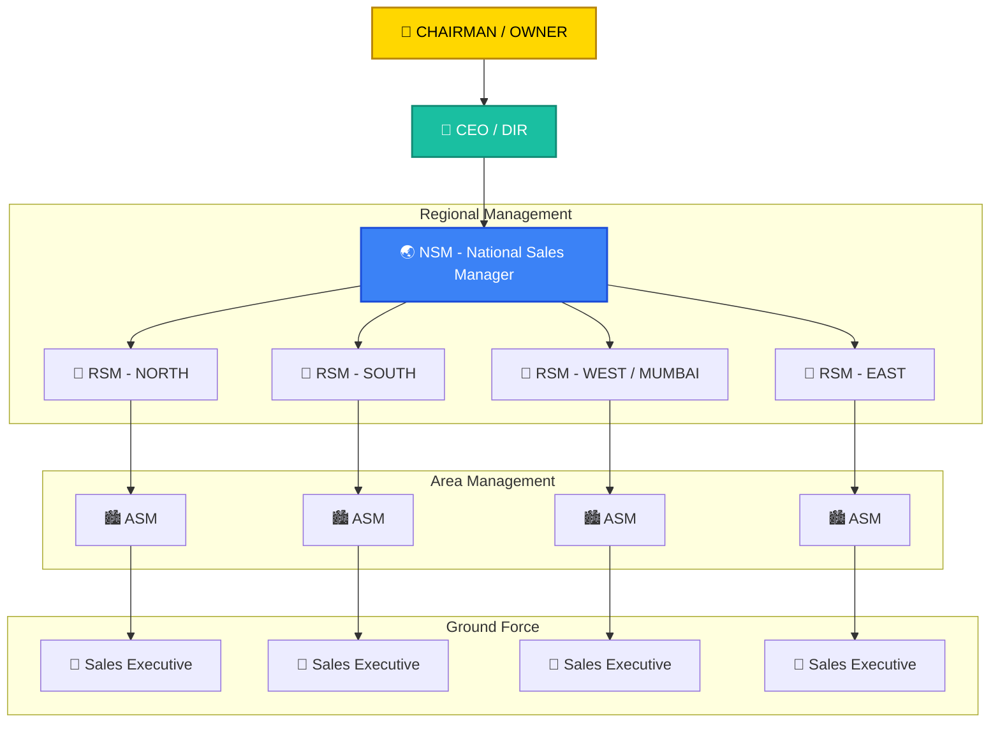
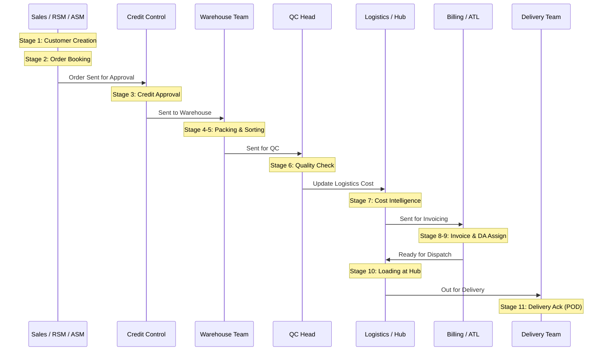

# 🛡️ NexusOMS - RBAC & Hierarchy Visual Guide

Yeh guide system ke roles, permissions aur hierarchy ko diagrams ke through samjhati hai.

---

## 🏗️ 1. Organizational Hierarchy (Sales Org Map)
System mein reporting structure niche diye gaye diagram ke according hai:

---

## 🔄 2. Mission Lifecycle Stages (RBAC Flow)
Order creation se delivery tak, kaunsa role kis stage pe kaam karta hai:

---

## 🛠️ 3. Dashboard Utilities Access
Roles ke access levels system hub mein:

| Role | Core Utilities Access |
| :--- | :--- |
| **Admin** | **EVERYTHING** (User Mgmt, Org Map, Master Data, etc.) |
| **Sales/RSM/ASM** | Live Missions, Executive Pulse, SKU Master, Team Hierarchy |
| **Credit Control** | Credit Alerts, Intelligence, Analytics |
| **Logistics/Hub** | Order Archive, Live Missions, Team Hierarchy |
| **Warehouse** | Live Missions, SKU Master |
| **Billing** | Live Missions, Order Archive |

---

### 🗝️ Key Points:
1.  **Hierarchy Logic:** RSM sirf apne niche waale ASMs aur Sales Executives ka data dekh sakta hai.
2.  **Zone Filtering:** North ka manager sirf North ka data dekhega (unless he is Admin).
3.  **Bypass System:** Agar koi position vacant (khali) hai, toh system automatically senior manager ko data forward kar deta hai.

---
**Generated for:** Animesh Jamuar (Admin)  
**System Version:** NexusOMS v12.5
